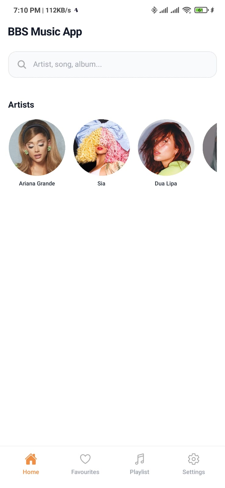
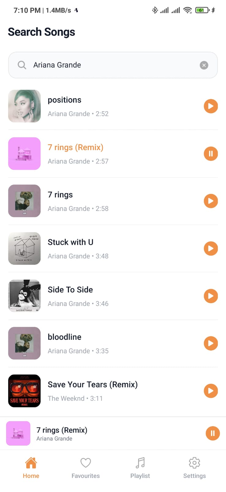
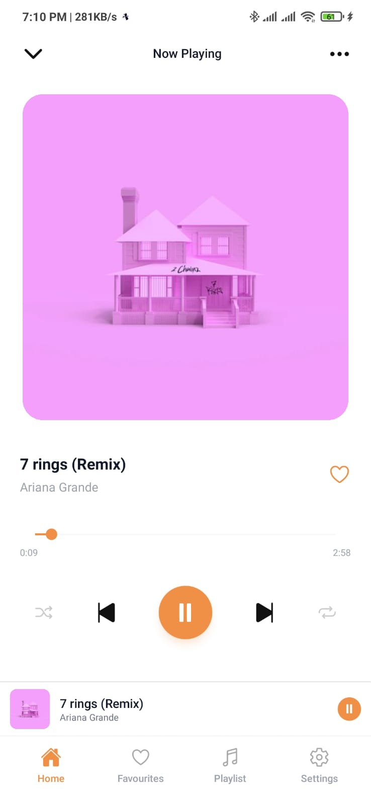

# 🎵 Lokal Music App

A clean and minimal **React Native Music Streaming App** built with Expo.
Search, play, and control songs with a smooth UI inspired by modern apps.

---

## ✨ Features

* 🔍 Search songs by artist, title, or album
* 🎧 Play music with smooth audio control
* ⏯ Play / Pause toggle (global)
* 🔄 Switch songs instantly (only one plays at a time)
* 🎵 Mini Player (persistent across screens)
* 📱 Clean & modern UI
* ⚡ Fast and lightweight

---

## 📸 Screenshots

### 🏠 Home Screen

<p align="center">
  
</p>

---

### 🔍 Song List / Search

<p align="center">
  
</p>

---

### 🎧 Player Screen

<p align="center">
  
</p>

---

## 🛠 Tech Stack

* React Native (Expo)
* TypeScript
* Zustand (State Management)
* Expo Audio
* React Navigation v6
* Tailwind (NativeWind)

---

## 📂 Project Structure

```
src/
 ├── screen/
 │    ├── Home.tsx
 │    ├── SearchSong.tsx
 │    ├── Player.tsx
 │
 ├── components/
 │    ├── MiniPlayer.tsx
 │    ├── BottomNav.tsx
 │
 ├── store/
 │    └── playerStore.ts
 │
 ├── player/
 │    └── audio.ts
 │
 ├── api/
 │    └── api.ts
 ├── types/
 │    └── song.ts
```

---

## 🚀 Getting Started

### 1. Clone the repo

```bash
git clone https://github.com/your-username/lokal-music-app.git
cd lokal-music-app
```

---

### 2. Install dependencies

```bash
npm install
# or
bun install
```

---

### 3. Run the app

```bash
npx expo start
```

---

## 🎮 Usage

* Tap a song → plays instantly
* Tap again → pause/play toggle
* Select another song → replaces current
* Use mini player for quick controls

---

## 🧠 Architecture

* **Zustand** → global state (song + play state)
* **audio.ts** → handles all audio logic
* **UI** → simple and reactive

---

## ⚡ Future Improvements

* ⏱ Progress bar with seek
* ⏭ Next / Previous controls
* 🎶 Playlist support
* 💾 Offline download
* 🎧 Background playback

---

## 📌 Author

Built with ❤️ by you

---

## ⭐ Support

If you like this project, give it a ⭐ on GitHub!
